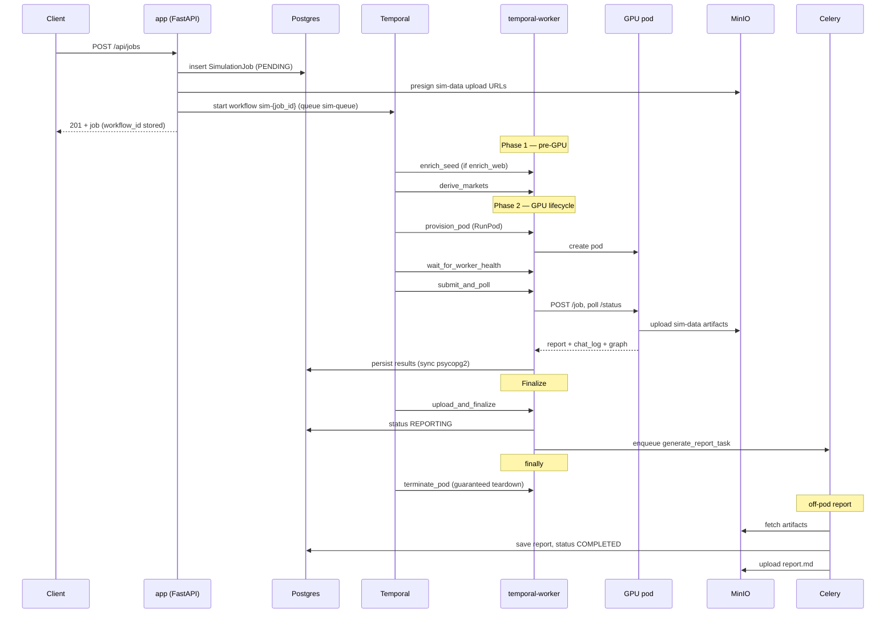

# Data Flow

This page traces a simulation job from the API request to the final report. The
flow is owned by a Temporal workflow (`SimulationWorkflow` in
`saas/workflows/sim_workflow.py`); the API only kicks it off, and the report is
generated off-pod by Celery.

## End-to-end sequence

## Step by step

### 1. API request

`create_job` in `saas/jobs/api.py`:

- Rejects job creation when `DEMO_MODE` is on (read-only deploys).
- Enforces `MAX_SEED_CHARS` and de-duplicates identical in-flight submissions
  within a 60-second window (`_DUP_JOB_WINDOW_SECONDS`).
- Validates that a `ModelRouting` row exists for the requested tier (no row →
  500). Routing supplies the `model_id`, `gpu_type`, `max_rounds`,
  `vllm_args`, and `target_agents`.
- Inserts a `SimulationJob` row at status `PENDING` (not yet committed) and
  flushes to get `job.id`.
- Presigns MinIO upload URLs for the sim-data artifacts via `SimDataStorage`.
- Starts the Temporal workflow with `id=f"sim-{job.id}"` on the
  `SIM_TASK_QUEUE` (`sim-queue`), then stores `workflow_id` and
  `workflow_run_id` on the row and commits.

If the Temporal dispatch fails, the session is rolled back and a 500 is
returned, so no orphaned job row is left behind.

### 2. Phase 1 — pre-GPU (Temporal activities)

Before any GPU is provisioned, the workflow runs two fail-soft activities, each
with a 180-second start-to-close timeout and two attempts:

- `fishcloud.enrich_seed` — xAI Grok web/X search enrichment (only when
  `enrich_web` is set).
- `fishcloud.derive_markets` — LLM derivation of the per-sim prediction
  markets.

No pod exists yet, so a failure here bypasses the GPU-phase handler; the
workflow explicitly calls `fishcloud.mark_failed` before re-raising.

### 3. Phase 2 — GPU lifecycle

The workflow provisions and drives an ephemeral pod through a set of activities
(`saas/workflows/activities/provisioning.py`, `pipeline.py`):

- `fishcloud.provision_pod` — create the GPU pod on the configured provider.
- `fishcloud.wait_for_worker_health` — poll until the pod's HTTP worker and
  vLLM are ready.
- `fishcloud.submit_and_poll` — `POST /job` to the pod and poll `/status` to
  completion. The pod uploads its rich artifacts directly to MinIO, and the
  activity persists the report/chat-log/graph/structured results to Postgres at
  the source (using sync psycopg2), so large payloads never traverse Temporal.

The workflow contains explicit recovery branches: a bad-host swap (one fresh
pod if vLLM never starts), pod-unreachable retries against the same pod (proxy
blips, no swap), and an LLM-circuit-breaker / slow-pod swap. These are bounded
so a permanent outage cannot strand a job. The same-host retries rely on
`submit_and_poll` being idempotent (it re-checks `/status` on entry).

### 4. Finalize

`fishcloud.upload_and_finalize` (`saas/workflows/activities/finalization.py`):

- Updates job metadata (pod id, provision/pipeline seconds).
- Requires that the pod uploaded its artifacts to MinIO — a missing upload is
  fatal (raises `RuntimeError`), because the report flow depends on those
  artifacts.
- Sets `sim_data_available = True`, transitions the job to `REPORTING`, and
  enqueues the Celery report task.

### 5. Teardown (guaranteed)

The workflow's `finally` block terminates whatever pod is still held via
`fishcloud.terminate_pod`. Bad-host and circuit-breaker swaps null out their pod
references after their in-loop terminate, so the final teardown runs at most
once per successful provision. GPU instances are ephemeral and teardown happens
even on failure — see [GPU Runner](../self-hosting/gpu-runner.md).

### 6. Off-pod report (Celery)

`generate_report_task` in `saas/jobs/tasks_report.py` runs on the Celery worker,
not on the GPU pod:

- Idempotency guard: if the job is already terminal (`COMPLETED`, `FAILED`, or
  `REFUNDED`), it skips.
- Builds a `ReportRunner` backed by the Anthropic client and runs it.
- Transient errors retry on an escalating backoff (`30, 120, 300, 900, 1800`
  seconds — a ~55-minute window); permanent errors and exhausted retries mark
  the job `FAILED`.
- On success it persists the report markdown and the structured payload
  (`adapt_structured`), derives a key insight, and uploads `report.md` to MinIO
  (non-fatal if MinIO is down — the DB row is authoritative).

## Job status progression

`JobStatus` (`saas/jobs/models.py`): `DRAFT → PENDING → PROVISIONING → RUNNING →
REPORTING → COMPLETED`, with `FAILED` reachable from any phase. `REFUNDED` is a
retained legacy value (see [Database Schema](database-schema.md)).

## Related

- [System Overview](system-overview.md) — the services involved.
- [Simulation Lifecycle](../concepts/simulation-lifecycle.md) — the conceptual view.
- [Temporal](../self-hosting/temporal.md) — operating the workflow engine.
