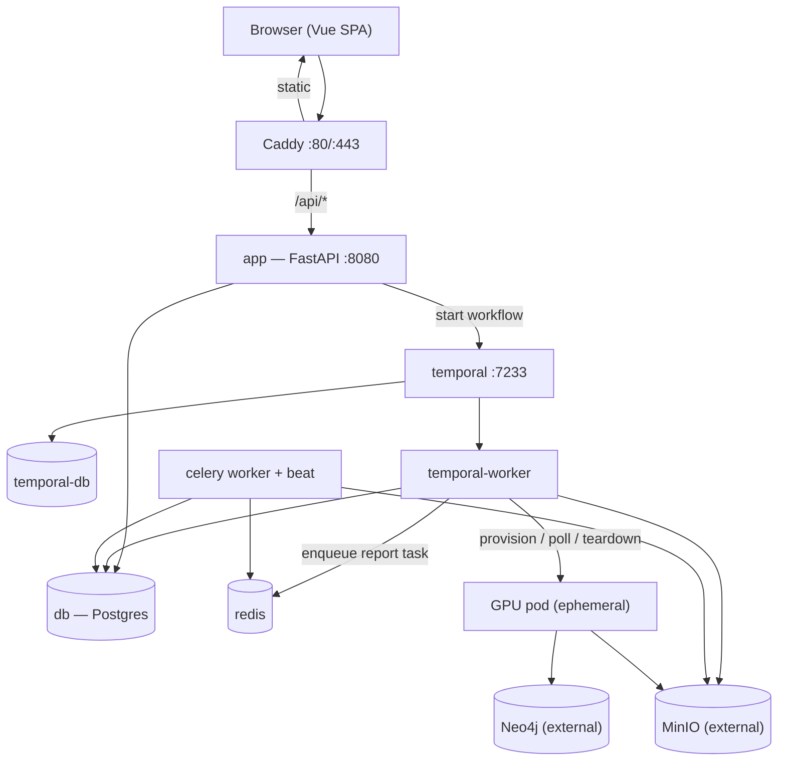

# System Overview

SimSwarm is a FastAPI backend, a Vue single-page app, a Temporal-orchestrated
simulation lifecycle, and a set of supporting datastores. This page maps the
running components and how they connect. It reflects the actual services
defined in `docker-compose.yml` and the API router assembled in
`saas/router.py`.

## Services

The Compose stack (`docker-compose.yml`) defines the following containers:

| Service | Image | Role |
| --- | --- | --- |
| `app` | `fishcloud-app` | FastAPI application (`saas.main:create_app`), serves the API on `127.0.0.1:8080`. |
| `celery` | `fishcloud-app` | Celery worker with embedded beat (`--beat`), `--concurrency=4`. Runs the off-pod report task and scheduled maintenance. |
| `db` | `postgres:16-alpine` | Primary application database (user `fishcloud`, db `fishcloud`). |
| `redis` | `redis:7-alpine` | Celery broker + result backend. |
| `temporal-db` | `postgres:16-alpine` | Dedicated Postgres for Temporal's own state. |
| `temporal` | `temporalio/auto-setup:1.22.7` | Temporal server (frontend on `127.0.0.1:7233`, namespace `fishcloud`). |
| `temporal-worker` | `fishcloud-app` | Runs `python -m saas.workflows.worker`; executes the simulation workflow + activities. |
| `caddy` | `caddy:2-alpine` | TLS-terminating reverse proxy on `:80`/`:443`; serves the built frontend from a shared volume. |
| `frontend-init` | `fishcloud-app` | One-shot: copies the built frontend into the `frontend_dist` volume. |
| `migrate` | `fishcloud-app` | One-shot: runs `alembic upgrade head` on deploy. |

Two datastores are external to this Compose file and run separately
(managed or on their own hosts):

- **Neo4j**: the entity graph database.
- **MinIO**: S3-compatible object storage for rich simulation artifacts and
  model weights. See [Storage](storage.md).

GPU pods are ephemeral and not part of the Compose stack. They are
provisioned per-job from a cloud provider (RunPod) and torn down on
completion. See [Data Flow](data-flow.md).

## API surface

`saas.main:create_app()` is an app factory. It accepts an optional `Settings`
(overridden in tests), configures structured logging and the slowapi rate
limiter, calls `init_db`, and mounts a single `api_router` (prefix `/api`).
That router (`saas/router.py`) includes one sub-router per feature:

| Router | Source | Responsibility |
| --- | --- | --- |
| health | `saas/health.py` | Liveness/health endpoint. |
| jobs | `saas/jobs/api.py` | Create/list/get/delete jobs, sim-data URLs, graph; mounts share/draft/retry sub-routers. |
| auth | `saas/auth/api.py` | Register, login, email verification, password reset. |
| progress | `saas/jobs/progress.py` | Live progress stream for a running job. |
| export | `saas/jobs/export.py` | PDF export of a completed report. |
| share | `saas/jobs/share.py` | Public share-token endpoints + demo listing. |
| fetch | `saas/jobs/fetch.py` | Server-side URL fetch for seed building. |
| profile | `saas/auth/profile.py` | Password change, account deletion. |
| ai | `saas/jobs/ai.py` | LLM-assisted goal generation. |

All routes are mounted under `/api`.

## How it connects

The API never runs a simulation itself. On job creation it starts a Temporal
workflow and returns immediately; the `temporal-worker` owns the rest of the
lifecycle. Report generation is handed off to the Celery worker after the sim
finishes. The next page traces that flow end to end.

## Related

- [Data Flow](data-flow.md): the end-to-end job lifecycle.
- [Database Schema](database-schema.md): the core tables.
- [Storage](storage.md): MinIO artifact layout and model weights.
- [Self-Hosting Architecture](../self-hosting/architecture.md): deploying the stack.
